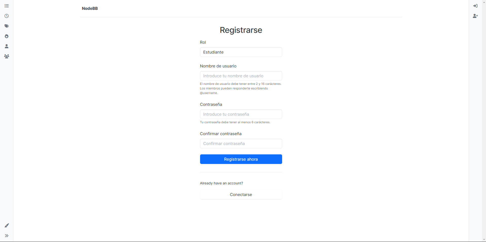
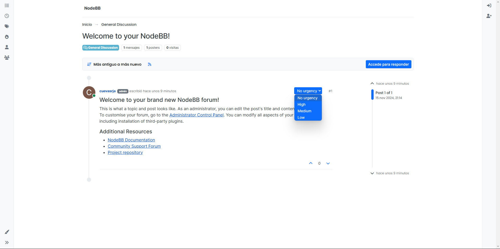
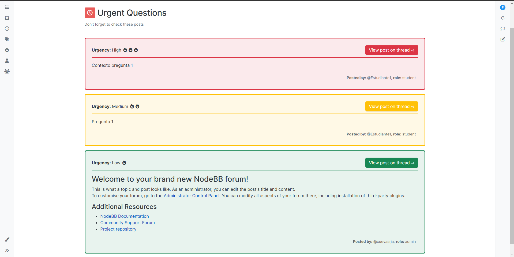

# Guía de usuario sobre features agregadas

## Introducción

En esta guía se describen las features agregadas al proyecto de la materia Ingeniería de Software 1, de la Universidad Simón Bolívar, en el trimestre Septiembre-Diciembre 2024.

### Integrantes

- Henry Galue _14-10373_
- Juan Cuevas _19-10056_
- Jeamhowards Montiel _19-10234_
- Miguel Salomón _19-10274_
- Anya Marcano _19-10336_

### Instalación

Para instalar el proyecto, se debe clonar el repositorio en la máquina local. Para ello, se debe ejecutar el siguiente comando en la terminal:

```bash
git clone https://github.com/USB-CI3715/nodebb-usb-24-geektech.git
```

Luego, se deben instalar las dependencias del proyecto y configurar la conexión a la base de datos. Para ello, se debe ejecutar el siguiente comando en la terminal:

```bash
./nodebb setup
```

> [!NOTE] Nota
> Nosotros usamos Redis como base de datos, sin embargo, se puede configurar cualquier otra base de datos soportada por NodeBB.

Por último, se debe activar el plugin implementado en el proyecto. Para ello, se debe ejecutar el siguiente comando en la terminal:

```bash
./nodebb activate new && ./nodebb build && ./nodebb start
```

## Features

### Feature 1 - Selección y visualización de roles de usuario

#### Descripción

Se agregó la funcionalidad de seleccionar y visualizar los roles de usuario en el perfil de usuario. Los roles de usuario son: Profesor, Estudiante y Administrador (Solo un administrador puede crear otros administradores).

Al crear un usuario, este tiene la opción de seleccionar un rol de usuario. Si el usuario no selecciona un rol, se le asigna el rol de Estudiante por defecto.

#### Capturas de pantalla



#### Instrucciones

Para seleccionar un rol de usuario, se debe seguir los siguientes pasos:

1. Seleccionar la opción "Registrarse" en la barra de navegación.
2. Llenar los campos del formulario de registro.
3. Seleccionar un rol de usuario en el campo "Rol".
4. Registrar el usuario. Después de registrarse, hay que seguir otros pasos para completar el registro.
5. El rol de usuario seleccionado se visualizará en el perfil de usuario.

### Feature 2 - Marcar el nivel de urgencia de las preguntas

#### Descripción

Se agregó la funcionalidad de marcar el nivel de urgencia de las preguntas en el foro. Los niveles de urgencia son: Bajo, Medio y Alto. (Por defecto el nivel es 'Sin urgencia').

Al crear una pregunta, el usuario tiene la opción de seleccionar un nivel de urgencia. Si el usuario no selecciona un nivel de urgencia, se le asigna el nivel de urgencia 'Sin urgencia' por defecto. Posteriormente, el usuario puede editar el nivel de urgencia de la pregunta.

#### Capturas de pantalla



#### Instrucciones

Para marcar el nivel de urgencia de una pregunta, se debe seguir los siguientes pasos:

1. Seleccionar un tema en el foro.
2. Seleccionar la opción "Hacer una pregunta" o seleccionar una pregunta existente.
3. Llenar los campos del formulario de pregunta.
4. Seleccionar un nivel de urgencia en el campo "Nivel de urgencia".
5. Publicar la pregunta. Después de publicar la pregunta, se puede editar el nivel de urgencia de la pregunta.
6. El nivel de urgencia seleccionado se visualizará en la pregunta.

### Feature 3 - Marcar preguntas como contestadas

#### Descripción

Se agregó la funcionalidad de marcar preguntas como contestadas en el foro. Al marcar una pregunta como contestada, se indica que la pregunta ha sido respondida y no se mostrará en la lista de preguntas sin responder.

Luego de crear una pregunta, el usuario tiene la opción de marcar la pregunta como contestada. Si el usuario no marca la pregunta como contestada, la pregunta se considera sin responder. Posteriormente, el usuario puede marcar la pregunta como contestada.

#### Capturas de pantalla


#### Instrucciones

Para marcar una pregunta como contestada, se debe seguir los siguientes pasos:

1. Seleccionar un tema en el foro.


### Feature 4 - Tab adicional con preguntas urgentes

#### Descripción

Se agregó una tab adicional en el foro con las preguntas urgentes. En esta tab se muestran las preguntas con nivel de urgencia asignado. Las preguntas se ordenan por nivel de urgencia (Alto, Medio, Bajo).

#### Capturas de pantalla



#### Instrucciones

Para visualizar las preguntas urgentes, se debe seguir los siguientes pasos:

1. Ser profesor y seleccionar la opción "Urgent Questions" en la barra de navegación.
2. Se mostrarán las preguntas con nivel de urgencia asignado.
3. Seleccionar una pregunta para ver más detalles.

